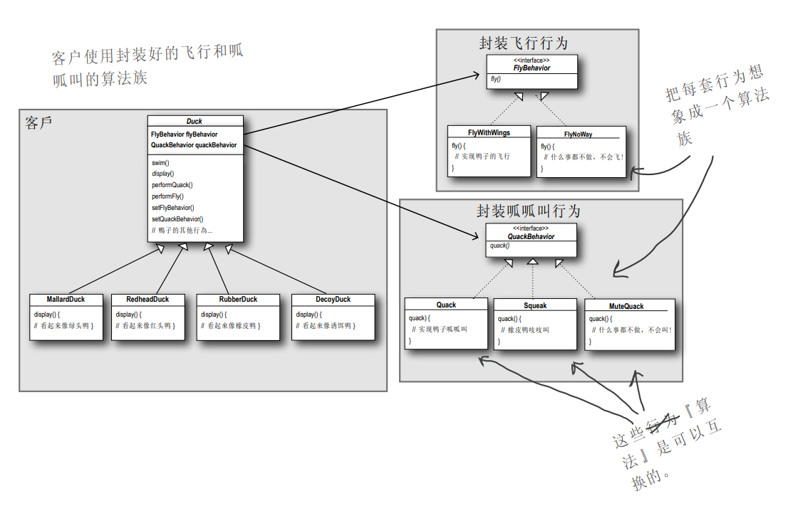

# 策略模式

## 定义

定义了算法族, 分别封装起来, 让它们之间可以互相替换, 此模式让算法的变化独立于使用算法的客户.

(例如, "鸭叫"是一组算法, "飞"是另外一组算法)

## 涉及到的单词

- mallard: /'mælɚd/, 绿头鸭
- rubber: /'rʌbɚ/, 橡皮
- decoy: /'dikɔɪ/, 诱饵
- quack: /kwæk/, 鸭叫声
- Squeak: /skwik/, 吱吱叫

## 基础: 先从简单的模拟鸭子应用做起

- 创建抽象超类 `Duck`, 里面含有方法`quack`, `swim()`, `display()`
- 所有子类都继承`Duck`, 例如`MallardDuck`, `RedheadDuck`, 覆盖 `display()` 方法

## 需求

现在我们得让鸭子能飞

## 解决方法 1——修改超类

在超类 `Duck` 中添加 `fly()`

## 方法 1 引起的问题

如果在超类 `Duck` 中添加 `fly()` 方法, 则所有子类(包括“橡皮鸭”)，因为继承的缘故, 同样也会`fly()`, 这是不合理的.

虽然可以使用覆盖, 使"橡皮鸭"在 `fly()` 方法中, 什么也不做, 但如果再创建一个"诱饵鸭"呢? 又要覆盖?

**总结其缺点:**

- 代码在多个子类中重复(例如: 不要的方法需要不断覆盖)
- 难以得知所有鸭子的全部行为(需要翻看父类实现)
- 运行时的行为不容易改变(就是将实现已经硬编码到了类中, 并不能通过 set 方法在运行的过程中做出改变)
- 改变会牵一发动全身, 造成其他鸭子不想要的改变

## 解决方法 2——利用接口

将 `fly()` 取出来, 放进一个"Flyable 接口"中, 这样只有会飞的鸭子才去实现(implements)这个接口.

## 方法 2 引起的问题

造成代码无法无法复用(每个相同的飞行动作, 在不同的子类中都需要再实现一遍?).

## 方法 3——策略模式

- 在超类中添加 `FlyBehavior` 和 `QuackBehavior` 两个属性(接口)
- 在构造函数中传入两个**实现接口的类的实例**

这样做, 就使用了组合的方式解耦.

