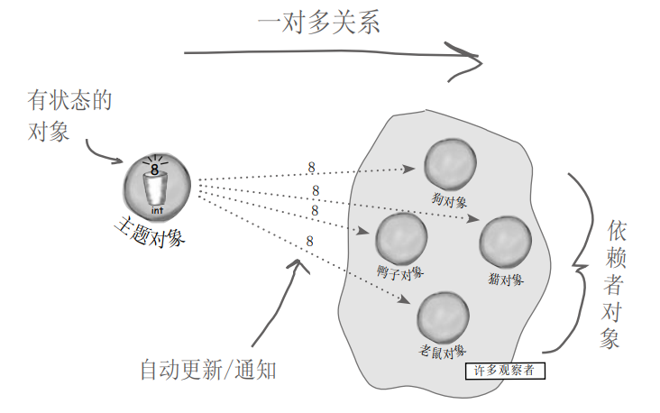

# 观察者模式

## 定义

定义了对象之间的一对多依赖，这样一来，当一个对象改变状态时，它的所有依赖者都会收到通知并自动更新。

## 项目需求

气象监测应用——当**温度**、**湿度**、**气压**发生改变时，就更行所有有关的**布告**。

系统必须是可扩展的，可以添加添加多个布告。现在有“目前状况”布告，“气象统计”布告，“天气预报”布告（其具体实现不管，只要知道要接受哪些天气参数）

## 普通写法的不足

`currentConditionsDisplay`、`statisticDisplay`、`forecastDisplay`分别对应不同的**布告**

## 观察者模式解决

- 为什么要在 Observer 中保存对 Subject 的引用？构造完成后，似乎用不到了？
- 方便后续注销