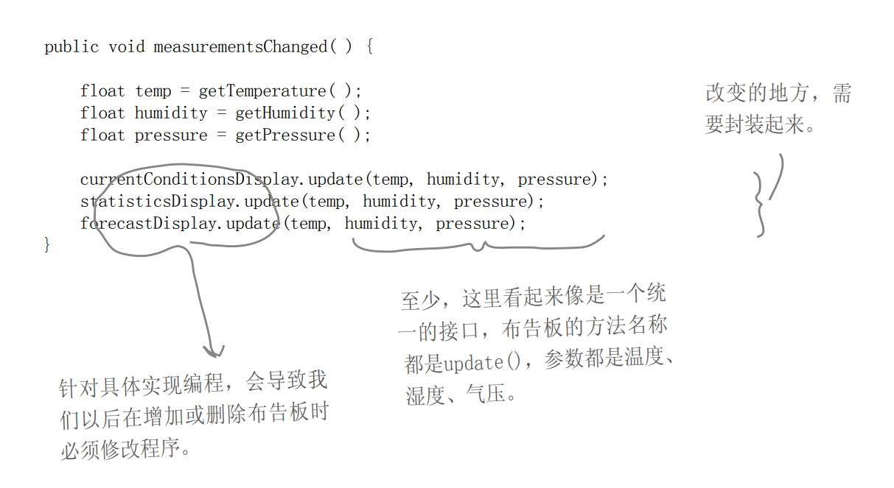

# 观察者模式

## 定义

定义了对象之间的一对多依赖，这样一来，当一个对象改变状态时，它的所有依赖者都会收到通知并自动更新。


## 项目需求

气象监测应用——当**温度**、**湿度**、**气压**发生改变时，就更行所有有关的**布告**。

系统必须是可扩展的，可以添加添加多个布告。现在有“目前状况”布告，“气象统计”布告，“天气预报”布告（其具体实现不管，只要知道要接受哪些天气参数）

## 普通写法的不足

`currentConditionsDisplay`、`statisticDisplay`、`forecastDisplay`分别对应不同的**布告**



## 观察者模式解决

```ts
// subject.ts
export interface Subject {
  // observers: Observer[];	// 使用数组，保存着观察者所有的引用
  registerObserver: (o: Observer) => void; // 数组添加而已：observers.push(o);
  removeObserver: (o: Observer) => void; // 寻找位置并删除
  notifyObservers: () => void; // 遍历调用：observers.forEach(o => o.update(this))
}
```

```ts
// observer.ts
export interface Observer {
  update: (subject: Subject) => void; // 将 "subject 推参数" 变为 "observer 拉参数"
  // 书中原版：update: (temperature: number, humidity: number, pressure: number) => void;
  // 这样是推参数的做饭，太死板, 有一些布告板只要其中的两个或者一个参数, 这样传递不合适
}
```

- 书中有提问：为什么要在 Observer 中保存对 Subject 的引用？构造完成后，似乎用不到了？
  - 书中答案是"方便后续注销"。
  - 但是我觉得没有必要保存。以 Subject 为主语，使用`subject.removeObservers(o)`即可。语义更加明确，同时可以为一个 Observer 注册到多个 Subject 中。
  - 同样的，书中是在`Observer.constructor`中调用`Subject.registerObserver(this)`，也可以写在外部。
- 结合书中 Java Observable 的设计
  - **将 "subject 推参数" 变为 "observer 拉参数"**，将参数传递变得更加灵活
  - 保留了第一版的接口形式，但是每次 Subject 和 Observer 的基础实现都是相同的，以后会有重复代码（为了面向接口编程，而不使用继承）